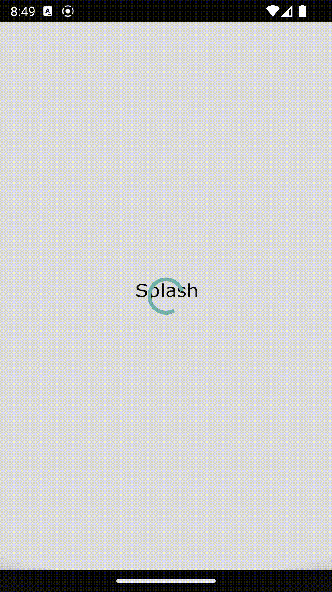
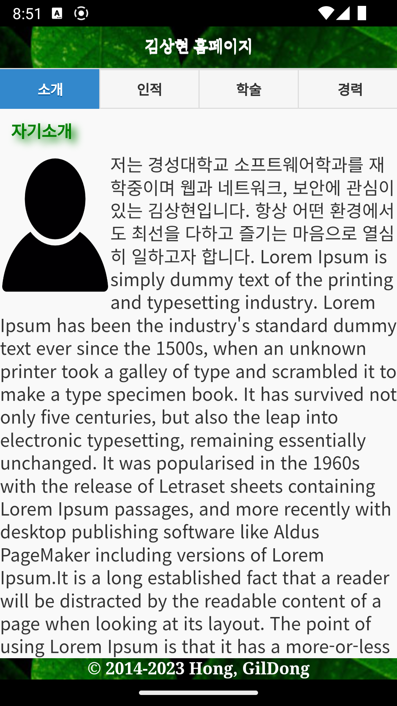
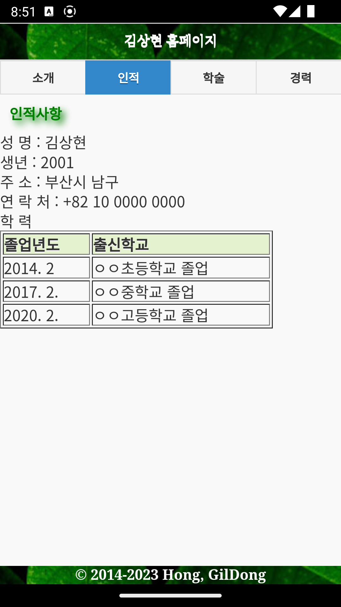
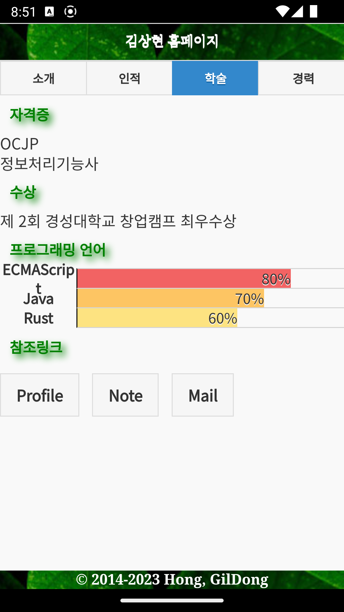
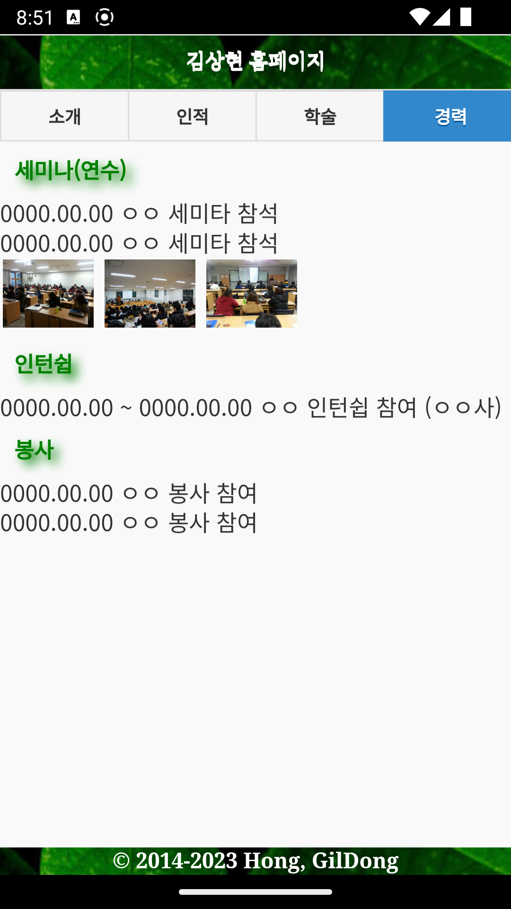

# 2023 고급 프로그래밍 과제 1
> 자신의 포트폴리오 앱

> Jquery Mobile를 사용한 Single Page 사이트 및 하이브리드 앱

## 추가/수정 내역
1. Multiple Page 사이트를 Jqeury Mobile를 사용하여 Single Page 사이트로 수정
2. Navbar를 Jquery Mobile의 Navbar로 변경
3. 컨텐츠 수정
4. chart.css 를 사용하여 chart 삽입
5. 스플래쉬 이미지 추가

## 환경
### 하드웨어
* Apple 2021 맥북프로 14 (M1 Pro 10Core X GPU 16Core X 1024GB X 32GB)

### 소트트웨어
* Android Studio
* Jetbrains WebStorm
* Gradle 8.0.2
* OpenJDK 1.8.0_292-b10
* Prettier
* Cordova

### 라이브러리
* Jquery 1.11.1
* Jquery Mobile 1.4.5
* chart.css 0.9.0
* cordova-plugin-splashscreen 6.0.2

## 사용 레퍼런스
* 원본 컨텐츠 : 박성진, 『모바일웹 + 웹앱 + 하이브리드앱 입문』, 생능출판사, 2017

### 스크린샷

