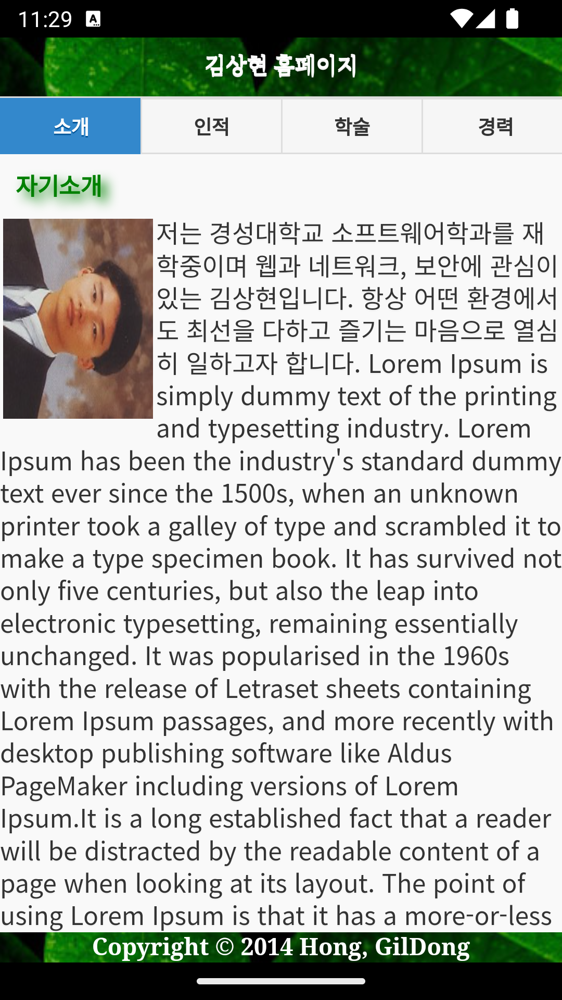
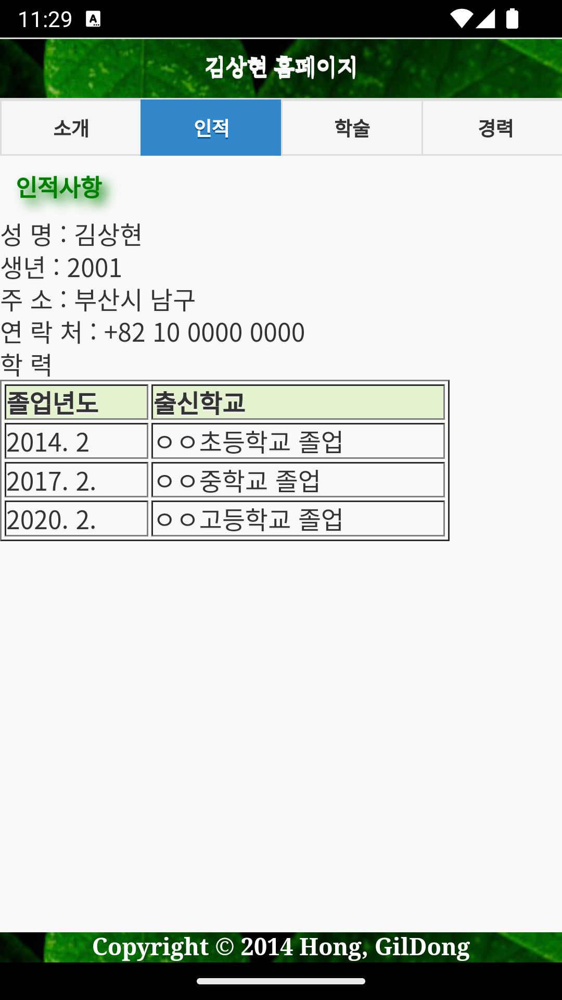
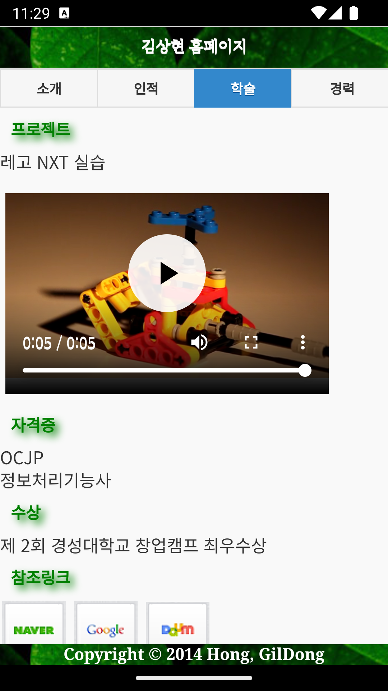
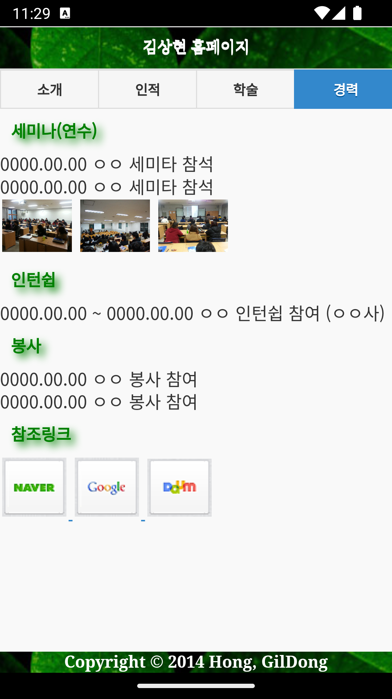

# 2023 고급 프로그래밍 과제 1
> 자신의 포트폴리오 앱

> Jquery Mobile를 사용한 Single Page 사이트

## 사용 레퍼런스 및 라이브러리
* 원본 컨텐츠 : 박성진, 『모바일웹 + 웹앱 + 하이브리드앱 입문』, 생능출판사, 2017

* Jquery 1.11.1

* Jquery Mobile 1.4.5

## 추가/수정 내역
1. Multiple Page 사이트를 Jqeury Mobile를 사용하여 Single Page 사이트로 수정
2. Navbar를 Jquery Mobile의 Navbar로 변경
3. 컨텐츠 수정

## 환경
### 하드웨어
* Apple 2021 맥북프로 14 (M1 Pro 10Core X GPU 16Core X 1024GB X 32GB)

### 소트트웨어
* Jetbrains WebStorm
* Android Studio

### 스크린샷

